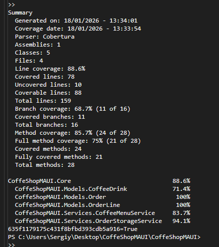

# CoffeShopMAUI

A cross-platform .NET MAUI ordering app created for the ATU Cross-Platform Development Assessment CA 1.

---

## Table of Contents
1. [Project Goals](#project-goals)
2. [UX Design](#ux-design)
3. [Features](#features)
4. [Information Architecture](#information-architecture)
5. [Technologies](#technologies)
6. [Testing](#testing)
7. [Deployment](#deployment)
8. [Credits](#credits)

---

## Project Goals
- **Business Goal:** Provide a mobile-first ordering experience for a boutique coffee shop.
- **User Goal:** Quickly browse categories (hot drinks, cold drinks, food), adjust quantities, and place an order from any supported platform.
- **Student Goal:** Demonstrate MAUI, MVVM, and local persistence skills for the CA submission.

## UX Design
- **Target Audience:** Walk-in customers, remote pickup users, and staff reviewing same-day orders.
- **User Stories:**
  - As a customer I want to see products grouped by category so that I can find items faster.
  - As a customer I want to edit quantities from the cart so that mistakes can be fixed before checkout.
  - As a staff member I want to review today’s orders so I can prepare them accurately.
- **Structure:** `AppShell` navigation drives page-to-page flow. Splash/login leads to the home page, which links to category pages, cart, checkout, and order history.
- **Wireframes/Mockups:** _Include links or screenshots of Figma/Whimsical boards here._

## Features
- Categorized menu (`Hot Drinks`, `Cold Drinks`, `Food`).
- Quantity steppers and cart summary with item removal.
- Checkout page collecting name and phone, generating a unique order number, and showing an order receipt.
- Order history page filtered to the current day using persisted data (file I/O or SQLite).
- Account/profile screen for optional customer preferences (placeholder for extension).
- Responsive styling with reusable resources defined in `Resources/Styles`.
- MVVM view models with commands, dependency-injected services, and navigation via `AppShell` routes.

### Future Enhancements
- Real-time stock updates from a remote API.
- Push notifications confirming order readiness.
- Payment gateway integration.

## Information Architecture
- **Data Models:** `MenuItem`, `CartItem`, `Order`, `OrderLine`.
- **Persistence:** Repository abstraction (file or SQLite) registered in `MauiProgram.cs`.
- **Navigation:**
  - `MainPage` (splash/login)
  - `HomePage`
  - `AllCoffeeShopPage` (category listing)
  - `CartPage`
  - `CheckoutPage`
  - `OrderReceiptPage`
  - `OrderHistoryPage`
  - `AccountInfoPage`

## Technologies
- .NET 8, C# 12
- .NET MAUI (Android, iOS, Windows, Mac Catalyst)
- MVVM Toolkit / ObservableObject pattern
- SQLite-net or System.Text.Json for storage
- Visual Studio 2022 17.8+

## Testing
Summarize manual and automated testing performed:
- **Unit Tests:** Automated view-model/service tests live in `CoffeShopMAUI.Tests`. Run `dotnet test CoffeShopMAUI.Tests` to execute them. Latest Cobertura output (18/01/2026 13:34) reported:
  - Line coverage 88.6% (78/88 lines), branch coverage 68.7% (11/16), method coverage 85.7% (24/28).
  - Fully covered methods: 21/28.
  - Breakdown: `CoffeShopMAUI.Core` 88.6%, `CoffeeDrink` 71.4%, `Order` 100%, `OrderLine` 100%, `CoffeeMenuService` 83.7%, `OrderStorageService` 94.1%.
	 
	
	
 

- **Manual Tests:**

| Scenario | Steps | Expected Outcome |
| --- | --- | --- |
| Add items across categories | Add hot, cold, and food items from the home page, then open the cart | Totals reflect each item, per-item quantity matches selections |
| Remove items from cart | From `CartPage`, tap trash icon beside an item | Item disappears, total recalculates immediately |
| Checkout validation | On `CheckoutPage`, submit with empty fields, then with valid name/phone | Validation blocks invalid submissions; valid submission navigates to receipt |
| Order history filter | Place two orders on the same day, then open `OrderHistoryPage` | Only today’s orders are listed, sorted newest first |
| Cross-platform smoke test | Deploy to Android emulator and Windows desktop | Navigation works, visuals align with design on both platforms |

- **Bugs/Issues:**
  - Order persistence currently uses local JSON; uninstalling the app removes history. Workaround: export history manually before uninstalling.
  - Checkout page lacks server-side validation; rely on client validation and manual staff checks until backend integration exists.

## Deployment
1. Clone repository and open `CoffeShopMAUI.sln` in Visual Studio.
2. Restore NuGet packages (`dotnet restore` or VS auto-restore).
3. Select target platform: Android emulator/device, Windows machine, iOS simulator, or Mac Catalyst.
4. Build and deploy (`F5`).
5. To publish, follow MAUI platform-specific publishing guides (APK/IPA/MSIX/PKG).

_GitHub Hosting:_ README and screenshots live at the repository root so the project overview appears on the repo front page.

## Credits
- **Author:** _Add your name, cohort, and Slack handle._
- **Acknowledgements:** Tutors, ATU Donegal.