# CoffeShopMAUI

A cross-platform .NET MAUI ordering app created for the ATU Cross-Platform Development Assessment CA 1.

---

## Table of Contents
1. [Project Goals](#project-goals)
2. [Assessment Checklist](#assessment-checklist)
3. [UX Design](#ux-design)
4. [Design Structure](#design-structure)
5. [User Stories & Use Cases](#user-stories--use-cases)
6. [Features](#features)
7. [User Manual](#user-manual)
8. [Information Architecture](#information-architecture)
9. [Data Persistence](#data-persistence)
10. [Technologies](#technologies)
11. [Testing](#testing)
12. [Deployment](#deployment)
13. [Credits](#credits)

## Project Goals
- **Business Goal:** Provide a mobile-first ordering experience for a boutique coffee shop.
- **User Goal:** Quickly browse categories (hot drinks, cold drinks, food), adjust quantities, and place an order from any supported platform.
- **Student Goal:** Demonstrate MAUI, MVVM, and local persistence skills for the CA submission.

[Back to Table of Contents](#table-of-contents)

## Assessment Checklist

| Marking Criterion | Implementation Notes |
| --- | --- |
| GUI – Listing products (30) | `HomePage` chips plus `AllCoffeeShopPage` grid expose Hot, Cold, Food, and Fresh Brews listings with visuals sourced from `Resources/Images`. |
| Selecting product amount (10) | `DetailPage` quantity steppers and `CartPage` +/- controls let users order multiple units per item. |
| Splash/Login page (10) | `MainPage` handles splash/login flow before navigating to home; splash assets defined via `Resources/Splash/splash.svg`. |
| App ease of use (10) | MVVM commands wire category chips, cart badge, and search; README’s Design Structure screenshots document the navigation clarity. |
| Remove basket items (10) | `CartPage` exposes decrement buttons and a trash icon per line item; `Clear Cart` resets the order. |
| MVVM design (10) | ViewModels (`HomeViewModel`, `AllCoffeeShopViewModel`, etc.) use CommunityToolkit.Mvvm attributes, dependency-injected services, and `RelayCommand`s. |
| Retrieve sales via file/DB (20) | `OrderStorageService` (documented in `Information Architecture`) persists orders locally; `OrderHistoryPage` filters by current date to satisfy the reporting requirement. |
| Checkout requirements | Checkout workflow gathers name/phone, generates order number, displays receipt, and stores order for history, matching CA brief. |

[Back to Table of Contents](#table-of-contents)

## UX Design
- **Target Audience:** Walk-in customers, remote pickup users, and staff reviewing same-day orders.
- **User Stories:**
  - As a customer I want to see products grouped by category so that I can find items faster.
  - As a customer I want to edit quantities from the cart so that mistakes can be fixed before checkout.
  - As a staff member I want to review today’s orders so I can prepare them accurately.
- **Structure:** `AppShell` navigation drives page-to-page flow. Splash/login leads to the home page, which links to category pages, cart, checkout, and order history.
- **Wireframes/Mockups:** _Include links or screenshots of Figma/Whimsical boards here._

[Back to Table of Contents](#table-of-contents)

## Design Structure

The following annotated walkthrough highlights each major screen so reviewers can correlate the MAUI navigation graph with actual UI. Every row captures a flow segment—authentication, browsing, ordering, history, and account management—so the visual structure mirrors the user stories described earlier.

| Login | Home | Hot Drinks | Cold Drinks |
| --- | --- | --- | --- |
| 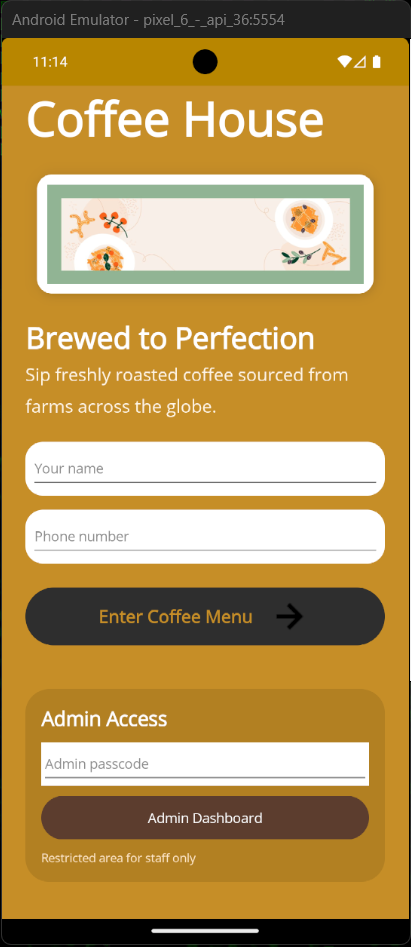 | 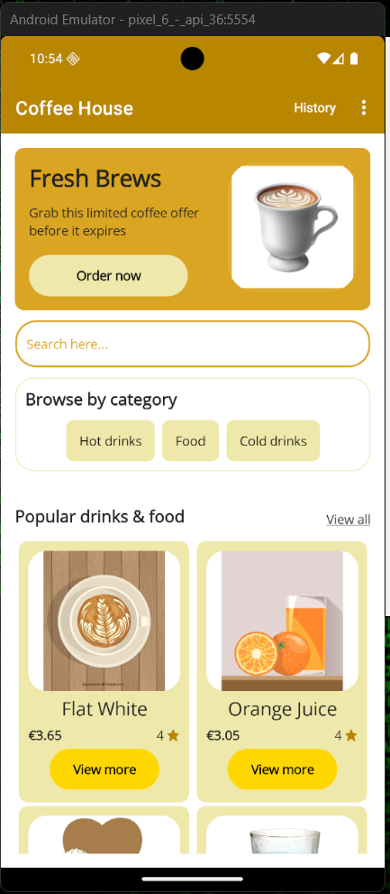 | 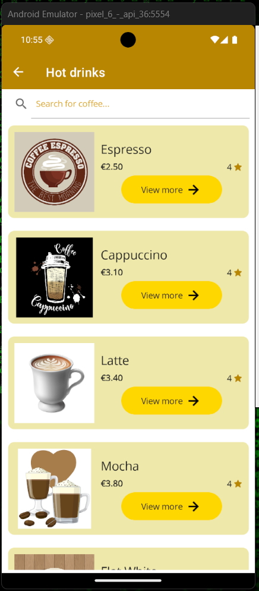 | 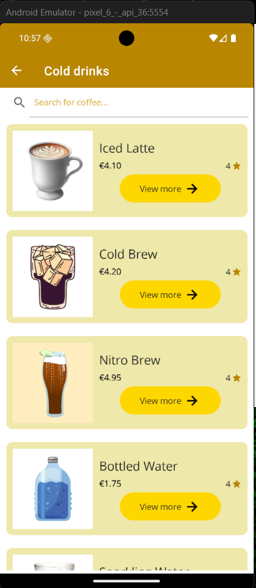 |

| Fresh Brews | All Categories | Food | Item Details
| --- | --- | --- | --- |
| 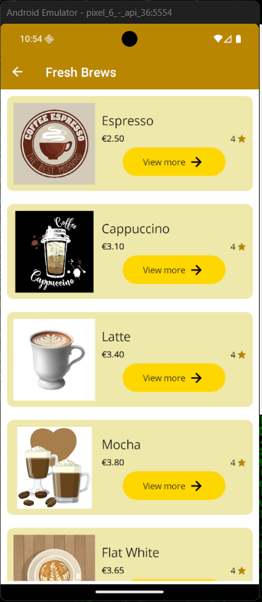 | 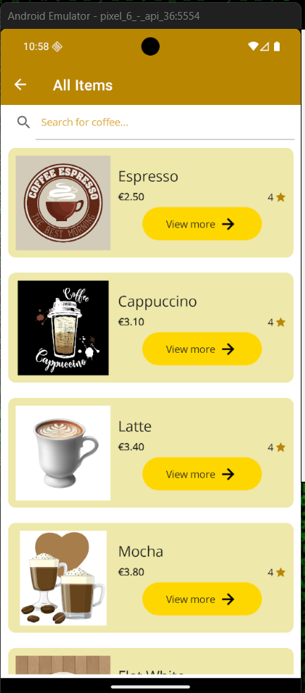 | 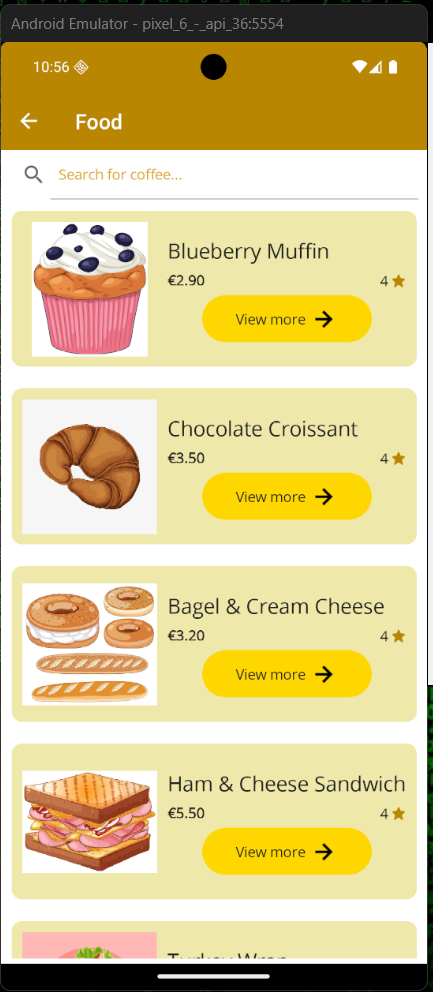 | 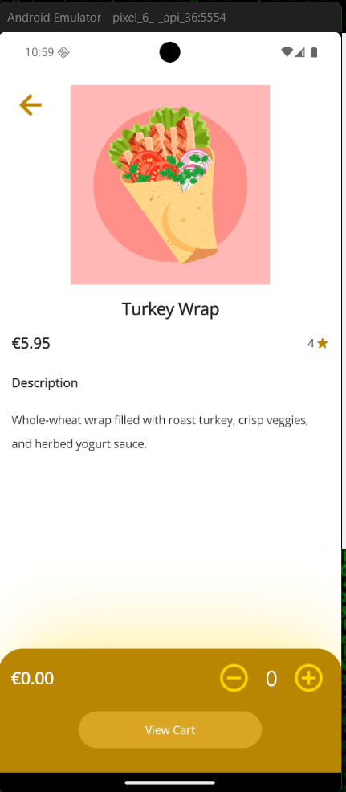 |

| Cart | Checkout | Order Receipt | Order History |
| --- | --- | --- | --- |
| 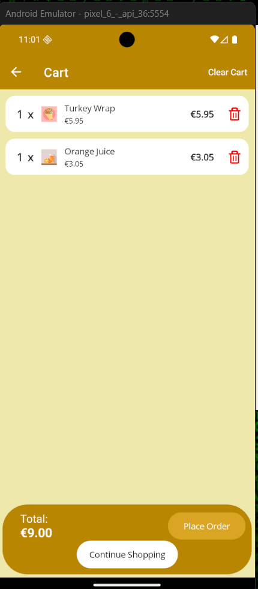 | 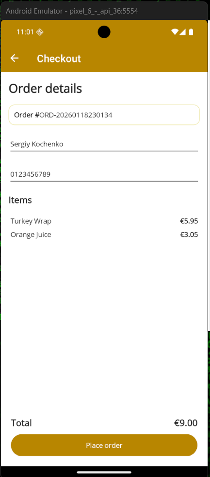 | 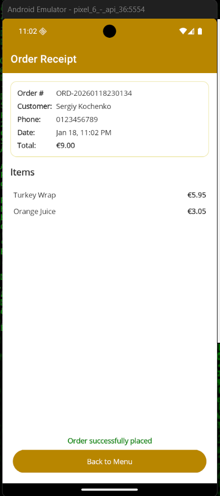 | 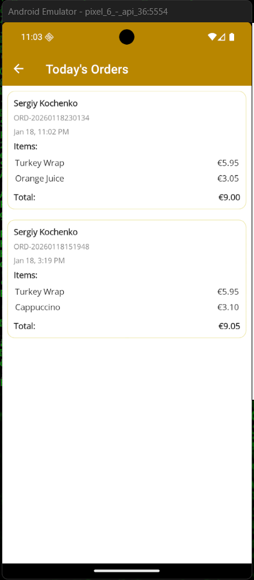 |

| My Account | Account Menu | Logout Menu | Logout Confirmation |
| --- | --- | --- | --- |
| 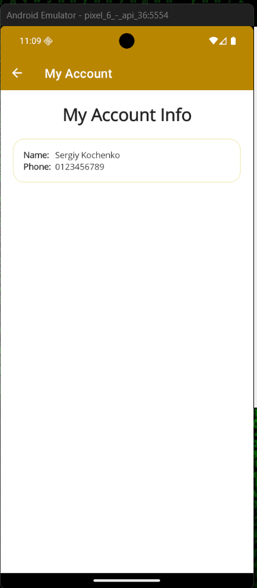 | 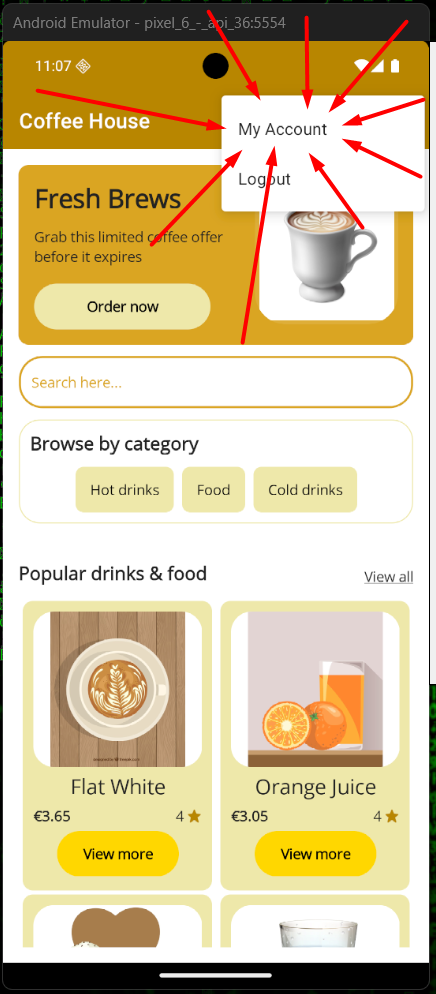 | 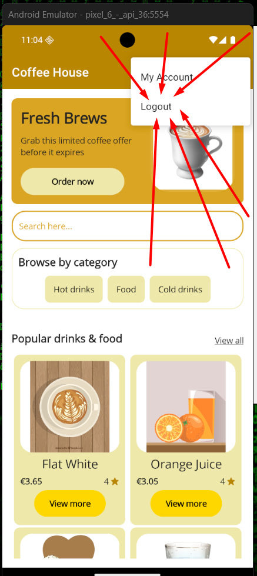 | 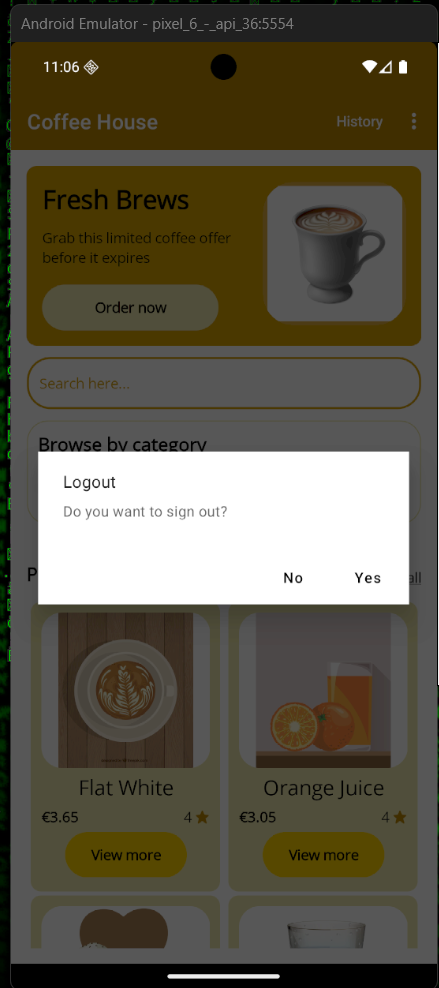 |

[Back to Table of Contents](#table-of-contents)

## User Stories & Use Cases

**User Stories**
1. As a new visitor, I want a fast splash/login so I can authenticate and start browsing without delay.
2. As a customer, I want category-filtered drinks so that I can quickly find hot, cold, or specialty items.
3. As a customer, I want to adjust quantities and see totals update instantly so mistakes are obvious before checkout.
4. As a returning customer, I want previous orders listed so I can reorder or show proof of purchase.
5. As staff, I want to review same-day orders so preparation stays on schedule.

**Use Cases**

| Use Case | Primary Actor | Trigger | Main Flow | Notes |
| --- | --- | --- | --- | --- |
| Browse Menu | Customer | User taps `Browse all drinks` or a category chip | App loads `AllCoffeeShopPage`, applies selected category, and shows drink cards with images and price. | Supports search bar for text filtering. |
| Manage Cart | Customer | User taps `Add to cart` on `DetailPage` | Quantity steppers set size/amount, command adds to cart, badge updates, and cart list recalculates totals. | Decrement/delete actions keep count >= 0; clear cart resets state. |
| Checkout Order | Customer | User presses `Place Order` on `CartPage` | Navigation to `CheckoutPage`, validation of name/phone, confirmation generates order number, then `OrderReceiptPage` displays receipt. | Stores order for history view; failure path highlights invalid fields. |
| Review Orders | Staff or Customer | User selects `History` tab | `OrderHistoryPage` loads persisted orders for current day sorted newest first. | Tapping entry reopens receipt for auditing. |

[Back to Table of Contents](#table-of-contents)

## Features
- Categorized menu (`Hot Drinks`, `Cold Drinks`, `Food`).
- Quantity steppers and cart summary with item removal.
- Checkout page collecting name and phone, generating a unique order number, and showing an order receipt.
- Order history page filtered to the current day using persisted data (file I/O or SQLite).
- Account/profile screen for optional customer preferences (placeholder for extension).
- Responsive styling with reusable resources defined in `Resources/Styles`.
- MVVM view models with commands, dependency-injected services, and navigation via `AppShell` routes.

[Back to Table of Contents](#table-of-contents)

## User Manual
1. **Launching the app**
   - Deploy via Visual Studio.
   - Sign in when the splash/login screen appears.
2. **Exploring the menu**
   - Use the category chips (`Hot Drinks`, `Cold Drinks`, `Food`) or tap `Browse all drinks` to open `AllCoffeeShopPage`.
   - Tap any drink to see its description, ingredients, and price on the detail page.
3. **Adding to the cart**
   - On the detail card, press `+`/`-` steppers to choose size and quantity, then tap `Add to cart`.
   - The cart badge updates instantly; open the cart via the toolbar button or `Cart` tab.
4. **Managing the cart**
   - Review every item on `CartPage`. Use the `+`/`-` controls to change quantities or the trash icon to remove items.
   - Tap `Clear Cart` from the toolbar to start over.
5. **Placing an order**
   - Hit `Place Order` on `CartPage` to navigate to `CheckoutPage`.
   - Enter your name and phone number, then confirm. Validation highlights any missing info.
   - A receipt with the order number displays on `OrderReceiptPage`. Use `Continue Shopping` to return home.
6. **Tracking past orders**
   - Open the `History` tab or `OrderHistoryPage` link to view the current day’s orders in reverse chronological order.
   - Tap an entry to re-open its receipt.
7. **Account & settings**
   - From the profile icon, open `AccountInfoPage` to update saved preferences (name, favorite drinks, pickup notes).
8. **Troubleshooting**
   - If totals look incorrect, refresh by pulling down on the cart list.
   - If the app was reinstalled, previous orders will be missing because storage is local; contact the shop if a receipt is needed.

 [Back to Table of Contents](#table-of-contents)
 
### Future Enhancements
- Real-time stock updates from a remote API.
- Push notifications confirming order readiness.
- Payment gateway integration.

[Back to Table of Contents](#table-of-contents)

## Information Architecture
- **Data Models:** `MenuItem`, `CartItem`, `Order`, `OrderLine`.
- **Persistence:** Repository abstraction (file or SQLite) registered in `MauiProgram.cs`.
- **Navigation:**
  - `MainPage` (splash/login)
  - `HomePage`
  - `AllCoffeeShopPage` (category listing)
  - `CartPage`
  - `CheckoutPage`
  - `OrderReceiptPage`
  - `OrderHistoryPage`
  - `AccountInfoPage`

[Back to Table of Contents](#table-of-contents)

## Data Persistence
- `OrderStorageService` (registered in `MauiProgram`) writes every confirmed `Order` to a JSON file named `orders.json` inside `FileSystem.Current.AppDataDirectory` (Android: `/data/data/<package>/files`, Windows: `%LOCALAPPDATA%\Packages\...\LocalState`).
- Saved payload includes the generated order number, timestamp, customer name, phone, and each `OrderLine`, satisfying the brief’s requirement to capture customer and receipt data.
- `OrderHistoryViewModel` queries the same file via `GetOrdersForDateAsync(DateOnly.FromDateTime(DateTime.Today))`, ensuring the history page only surfaces orders from the current day.
- Because the storage is file based, migrating to SQLite simply requires swapping the implementation registered for the `OrderStorageService` abstraction without changing the UI.

[Back to Table of Contents](#table-of-contents)

## Technologies
- .NET 8, C# 12
- .NET MAUI (Android, iOS, Windows, Mac Catalyst)
- MVVM Toolkit / ObservableObject pattern
- SQLite-net or System.Text.Json for storage
- Visual Studio 2022 17.8+

[Back to Table of Contents](#table-of-contents)

## Testing
Summarize manual and automated testing performed:
- **Unit Tests:** Automated view-model/service tests live in `CoffeShopMAUI.Tests`. Run `dotnet test CoffeShopMAUI.Tests` to execute them. Latest Cobertura output (18/01/2026 13:34) reported:
  - Line coverage 88.6% (78/88 lines), branch coverage 68.7% (11/16), method coverage 85.7% (24/28).
  - Fully covered methods: 21/28.
  - Breakdown: `CoffeShopMAUI.Core` 88.6%, `CoffeeDrink` 71.4%, `Order` 100%, `OrderLine` 100%, `CoffeeMenuService` 83.7%, `OrderStorageService` 94.1%.
 	 
	
	
- **Manual Tests:**

| Scenario | Steps | Expected Outcome |
| --- | --- | --- |
| Add items across categories | Add hot, cold, and food items from the home page, then open the cart | Totals reflect each item, per-item quantity matches selections |
| Remove items from cart | From `CartPage`, tap trash icon beside an item | Item disappears, total recalculates immediately |
| Checkout validation | On `CheckoutPage`, submit with empty fields, then with valid name/phone | Validation blocks invalid submissions; valid submission navigates to receipt |
| Order history filter | Place two orders on the same day, then open `OrderHistoryPage` | Only today’s orders are listed, sorted newest first |
| Cross-platform smoke test | Deploy to Android emulator and Windows desktop | Navigation works, visuals align with design on both platforms |

- **Bugs/Issues:**
  - Order persistence currently uses local JSON; uninstalling the app removes history. Workaround: export history manually before uninstalling.
  - Checkout page lacks server-side validation; rely on client validation and manual staff checks until backend integration exists.

[Back to Table of Contents](#table-of-contents)

## Deployment
1. Clone repository and open `CoffeShopMAUI.sln` in Visual Studio.
2. Restore NuGet packages (`dotnet restore` or VS auto-restore).
3. Select target platform: Android emulator/device, Windows machine, iOS simulator, or Mac Catalyst.
4. Build and deploy (`F5`).
5. To publish, follow MAUI platform-specific publishing guides (APK/IPA/MSIX/PKG).

_GitHub Hosting:_ README and screenshots live at the repository root so the project overview appears on the repo front page.

[Back to Table of Contents](#table-of-contents)

## Credits
- **Author:** Student of ATU Donegal - Mr.Sergiy Kochenko — Lead designer/developer responsible for UX research, MAUI implementation, and testing.
- **Acknowledgements:** Tutor of Cross Platform Development - Mr.Gerard McCloskey at ATU Donegal for architectural guidance, assessment feedback, and lab support.

[Back to Table of Contents](#table-of-contents)